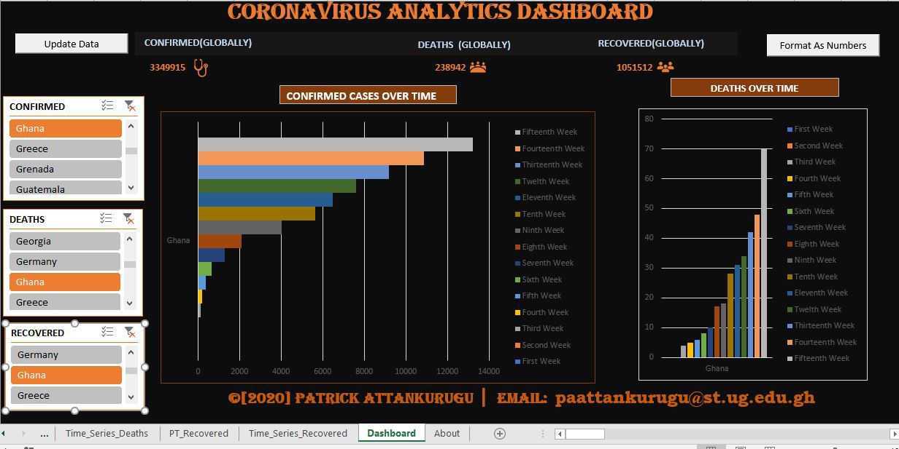

# COVID-19 Analytics Dashboard

## Description

During the COVID-19 lockdown in 2020, as people across the globe faced challenges in keeping track of the evolving situation, this project was developed to provide comprehensive, real-time updates on the virus's spread. This data analytics solution is built on Excel, Pivot Tables, and Macros, leveraging data from the John Hopkins University database and other reliable sources endorsed by the World Health Organization. 

The goal of the software is to automatically pull updates of COVID-19 cases from around the world and analyze them into visually comprehensible charts and graphs. This means that even before local TV stations in Ghana can announce the updates, our dashboard will have the information readily available. 

## Features
- Real-time data updates from reliable sources.
- Data analysis presented through easily understandable charts and graphs.
- Automatic data pulling and visualization.

## Instructions

Due to the size of the project, it couldn't be uploaded to Github directly. Instead, it is available for download on Google Drive. Please follow the instructions below to get the software:

1. [Download the file from Google Drive](https://drive.google.com/file/d/1njYO0TRhwKK9lPr9zPGfjHLGlH8JUyr1/view?usp=sharing).
2. After downloading, open the file in Microsoft Excel.
3. Ensure that your Macros are enabled to allow automatic updates. 
   
Please note: Basic knowledge of Excel is required to navigate and understand the dashboard effectively.

## Feedback

If you have any feedback or suggestions, feel free to open an issue or submit a pull request.

## Acknowledgements

Special thanks to John Hopkins University and the World Health Organization for providing the data sources that power this project.

## License

[MIT](https://choosealicense.com/licenses/mit/)

